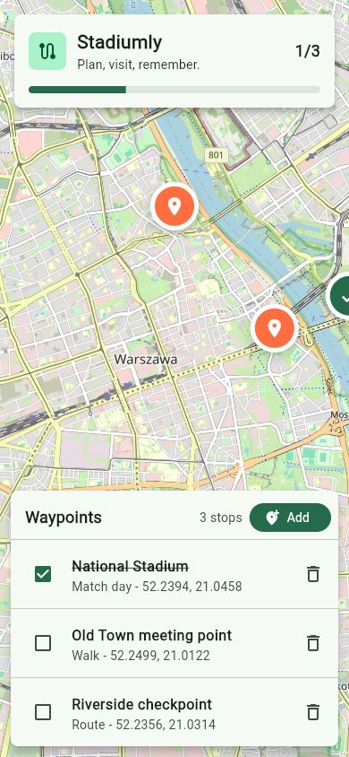

# Stadiumly

Flutter app for marking waypoints on an OpenStreetMap-based map and tracking visits.

## Product idea

Stadiumly helps users create waypoint lists, navigate to places, and mark them as visited.

## Current UI

- Interactive OpenStreetMap view centered on Warsaw
- Waypoint markers with visited and unvisited states
- Trip progress card with visited count
- Bottom waypoint list with quick visit toggles and delete actions
- Add button for creating the next stop

## Planned stack

- Flutter
- OpenStreetMap tiles
- Local persistence for saved waypoints and visit state
- Optional sync/auth later

## First milestone

- Create a Flutter app shell
- Show an interactive OpenStreetMap map
- Let users add, edit, and delete waypoints
- Mark waypoints as visited
